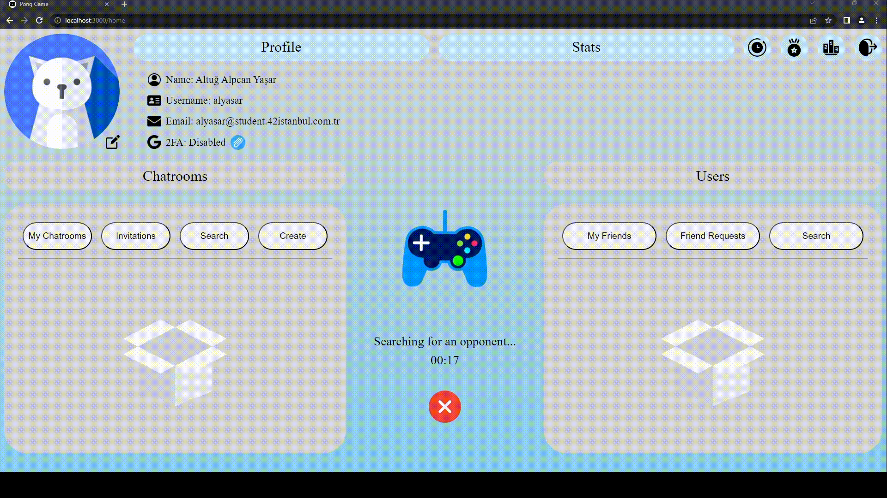

# 42-ft_transcendence

**Score: 100/100**

This project is about creating a website for people to play Pong against each other.

In this project I was mainly responsible from the Backend side.

## Images & Gifs

## Features & Technologies
- **[General Project Structure]**
    - **User Account**
        - Authentication & Authorization
            - 42's API ([X](https://api.intra.42.fr/apidoc))
            - Passport ([X](https://www.npmjs.com/package/passport)) & Passport-42 ([X](https://www.npmjs.com/package/passport-42/v/1.0.0))
            - 2FA
                - Speakeasy ([X](https://www.npmjs.com/package/speakeasy))
                - Qrcode ([X](https://www.npmjs.com/package/qrcode))
        - Friend Request System
        - Status System
        - User Statistics
        - Ranking & Level System
        - Achievement System
        - Match History

    - **Chat**
        - Channels (Chatrooms)
            - Channel Types
                - Public
                - Private (Invite only)
                - Protected (With password)
                    - Bcrypt ([X](https://www.npmjs.com/package/bcrypt))
            - Administrator System
                - Mute
                - Kick
                - Ban
            - Game Invitation System
        - Direct Messages (DM)
            - Game Invitation System

    - **Game**
        - Matchmaking System
        - Customizable Map

- **[Database]**
    - **PostgreSQL** ([X](https://www.postgresql.org/))

- **[Backend]**
    - **NestJS** - **TypeScript** ([X](https://nestjs.com/))
    - Prisma ORM (Database <--> Backend) ([X](https://www.prisma.io/))

- **[Frontend]**
    - **React** - **TypeScript** ([X](https://react.dev/))

- **[Other Tools]**
    - Makefile ([X](https://en.wikipedia.org/wiki/Make_(software)))
    - Docker ([X](https://www.docker.com/))
    - Websockets (Socket.IO) ([X](https://socket.io/))

## Usage

Just use `make` to build everything from ground.

You can access the website through `http://localhost:3000` after everything gets compiled successfully.

**!! IMPORTANT NOTE !!**

You need to provide `INTRA_API_CLIENT_ID` and `INTRA_API_CLIENT_SECRET` inside the `srcs/backend/srcs/.env` file in order to login to the website. If you're a student of 42 Schools you can follow the [documentation](https://api.intra.42.fr/apidoc) for that. Also, after creating the application you need to enter `http://localhost:3001/auth/callback` on Redirect URI section.

## Contributors

- [@Scienitive](https://www.github.com/Scienitive)
- [@onermorkoc](https://www.github.com/onermorkoc)
- [@yusufaysu](https://www.github.com/yusufaysu)

